# Screenshot evidence

All images were captured from the ARM64 QEMU Android device during this run. Identification results use deterministic debug responses; see [the report](report.md) for limits and failures. Screenshots remain unedited.

## 01-candidates-bottom.png

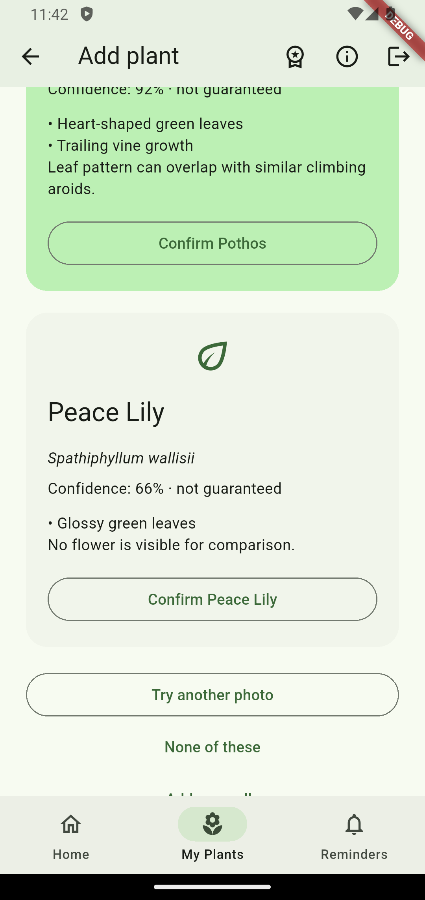

## 01-candidates.png

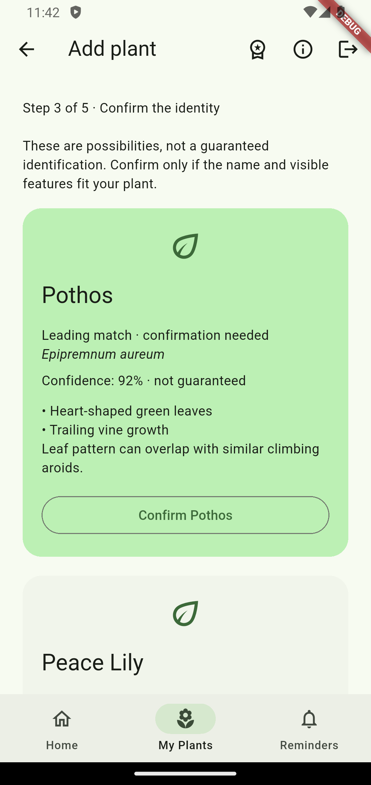

## 01-consent-checked.png

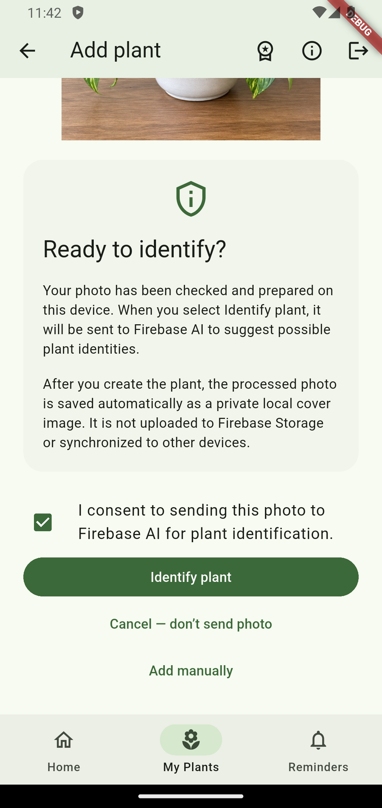

## 01-photo-preview.png

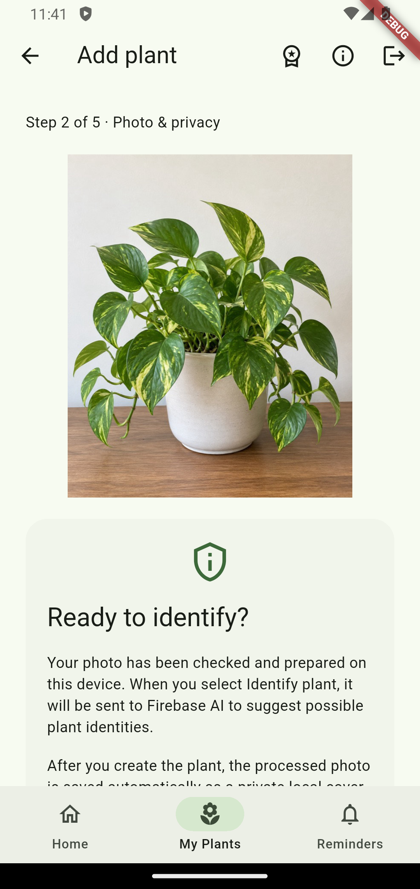

## 01-profile-questions.png

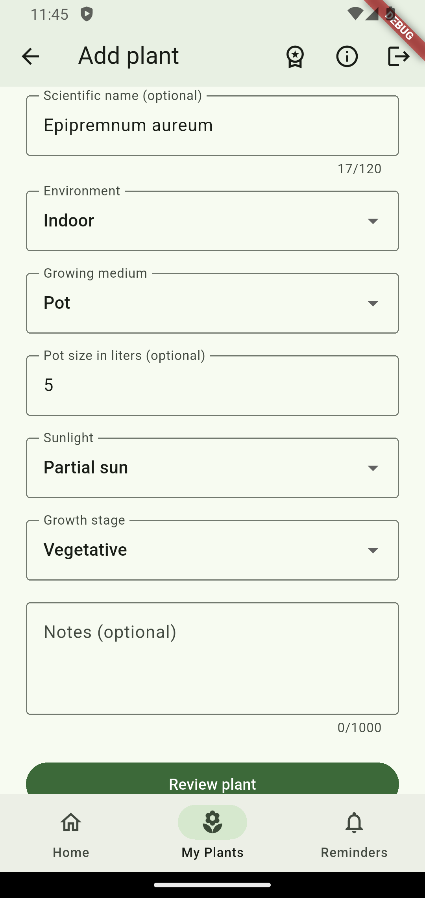

## 01-profile-review.png

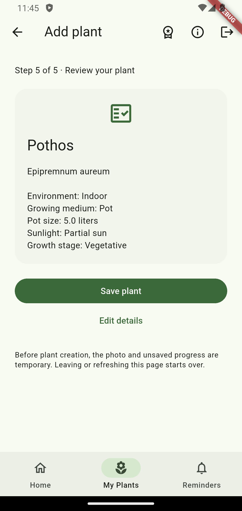

## 01-saved-details.png

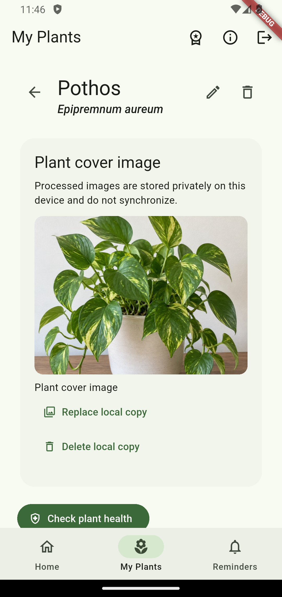

## 01-saved.png

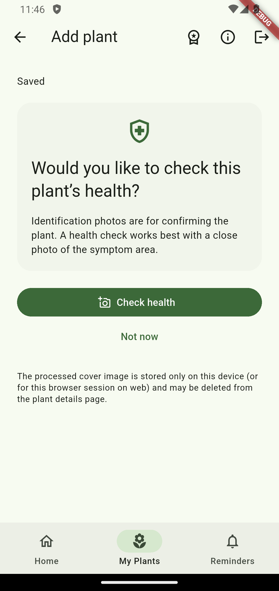

## 02-low-confidence.png

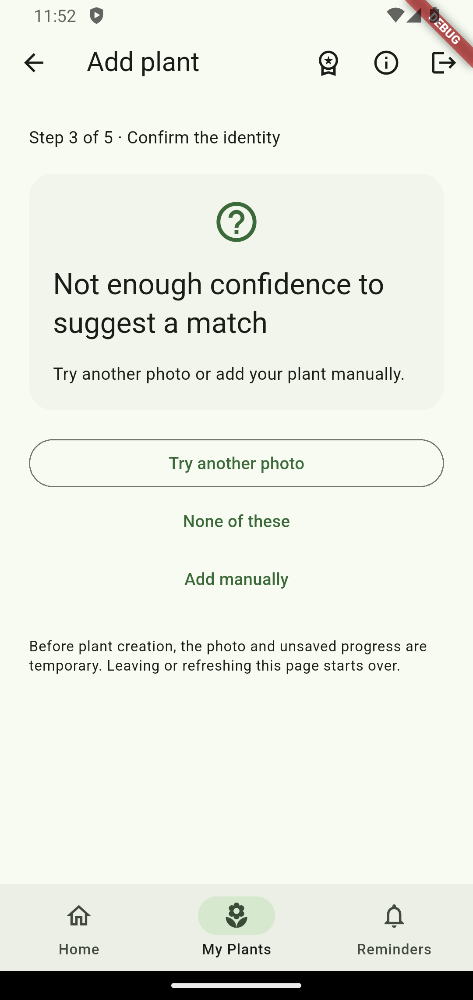

## 03-manual-fallback.png

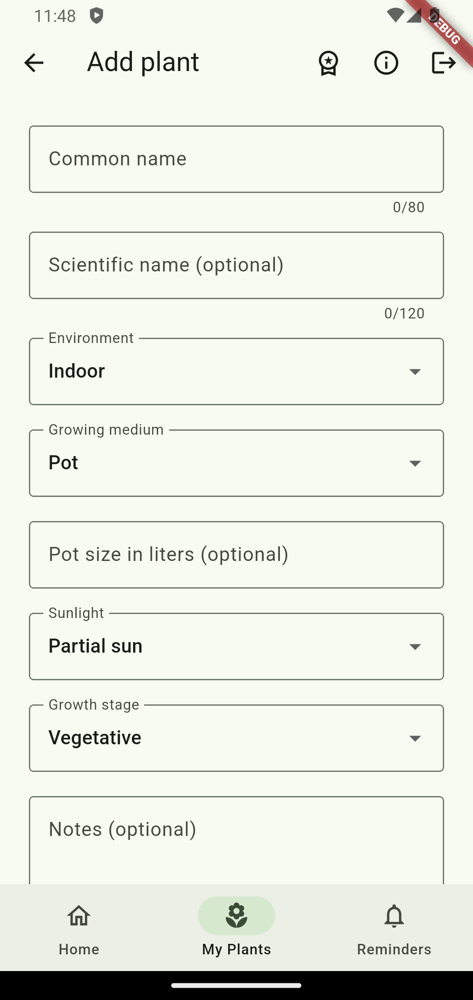

## 03-no-consent-with-recorder.png

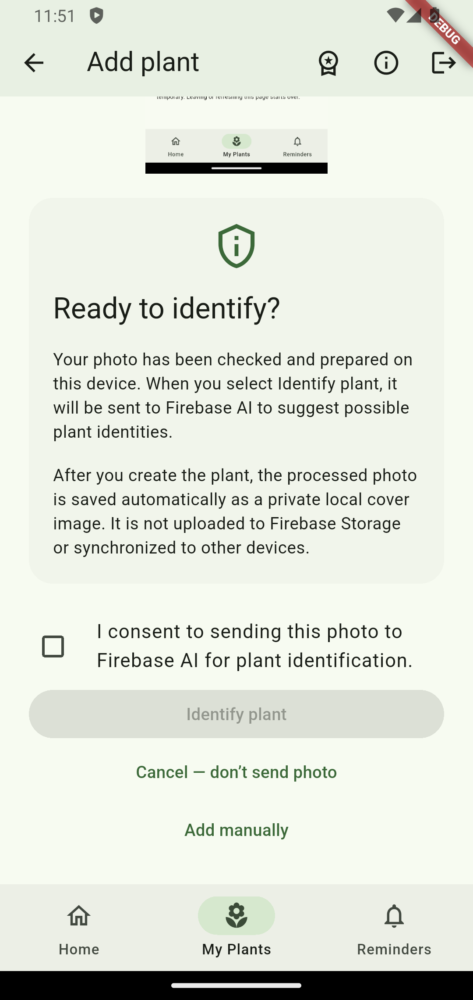

## 03-no-consent.png

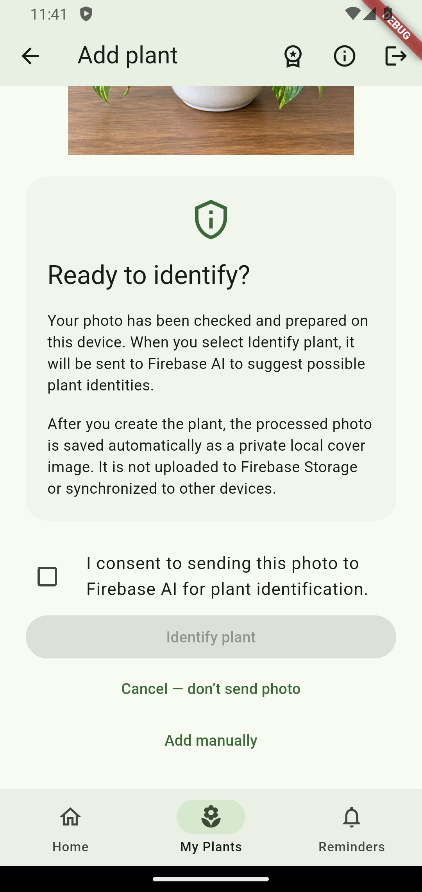

## 04-invalid-format.png

## 04-invalid-with-recorder.png

## 04-oversize-with-recorder.png

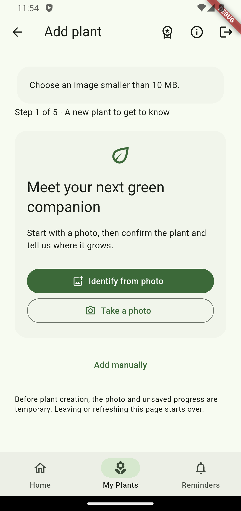

## 04-oversize.png

## 05-collection-no-warning.png

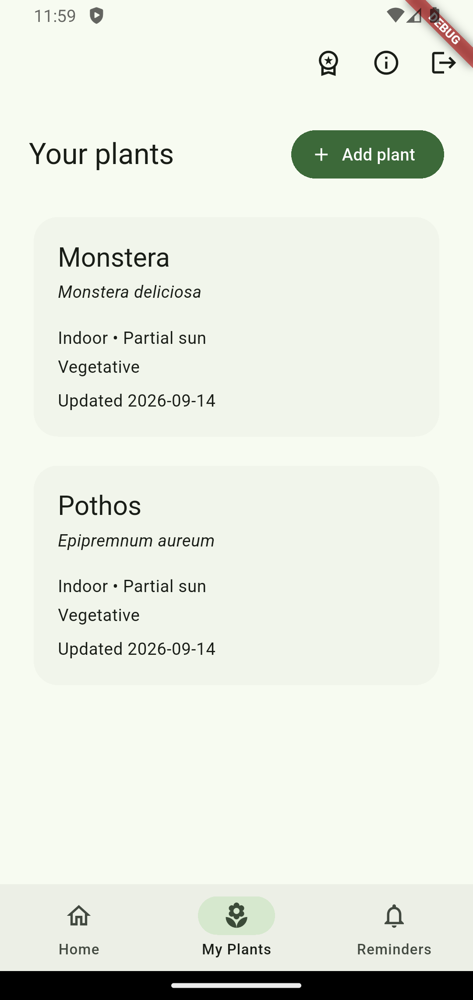

## 05-profile-review-warning.png

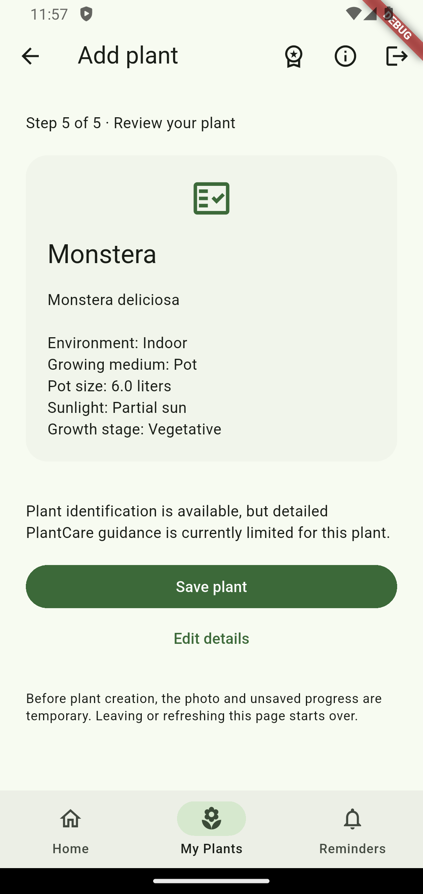

## 05-saved-details-care.png

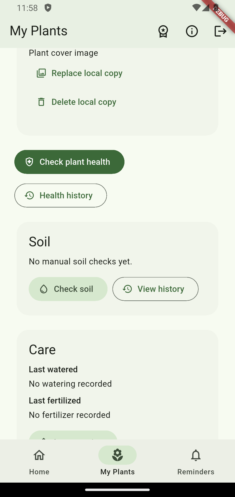

## 05-saved-details-guidance.png

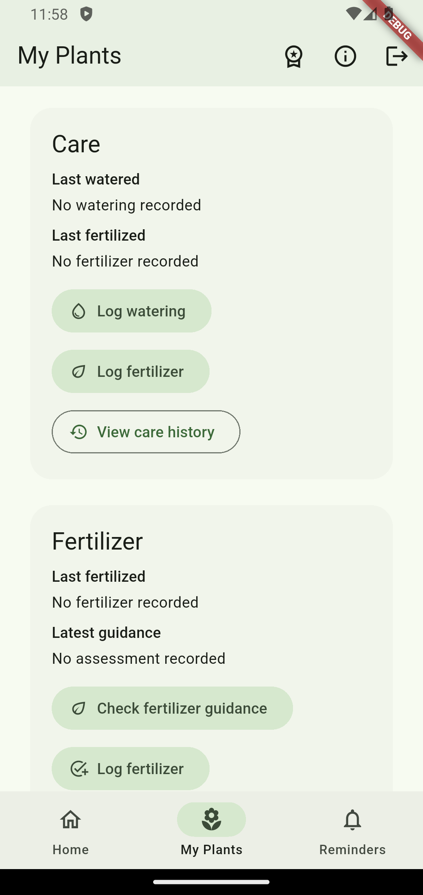

## 05-saved-details-profile.png

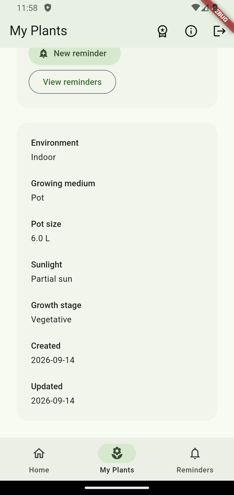

## 05-saved-details-reminders.png

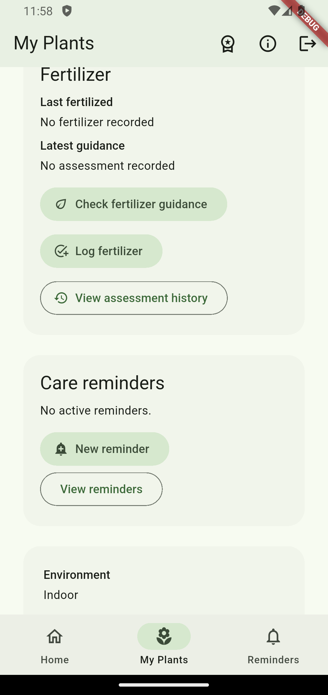

## 05-saved-details-top.png

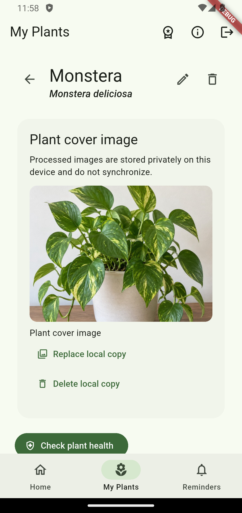

## 05-saved-no-warning.png

## 05-unsupported-candidate.png

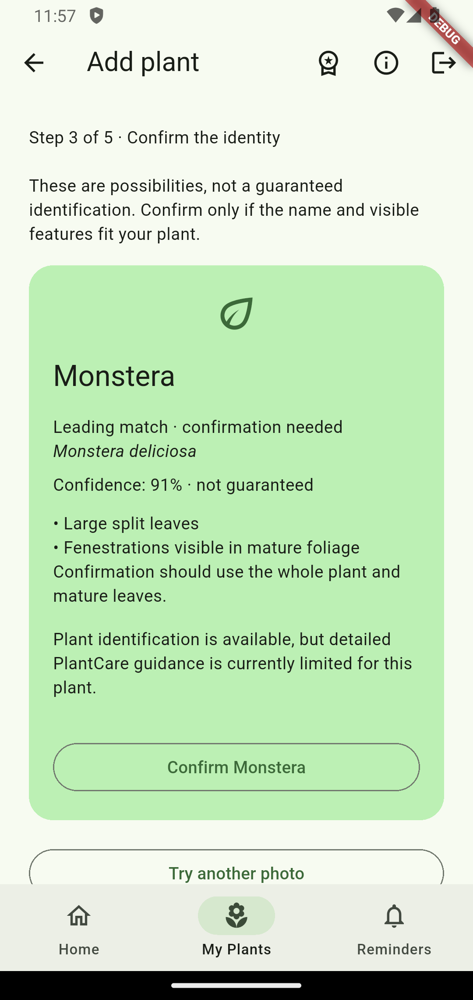

